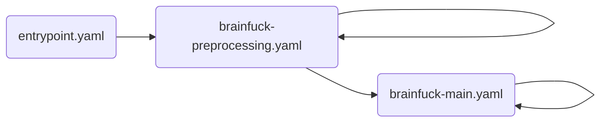

:::message
この記事は、[CYBOZU SUMMER BLOG FES '24](https://cybozu.github.io/summer-blog-fes-2024/) (生産性向上 セイサンシャインビーチ Stage) DAY 5 の記事です。
:::

チューリング完全とは、ざっくり説明すると、一部を除くほとんど全ての計算が可能な能力を意味します。言い換えると、ほとんど全ての計算問題を解く能力を意味します。（あとでもう少し詳しく説明します。）プログラミング言語は一般にチューリング完全であり、例えば TypeScript や Python はチューリング完全です。プログラミング言語以外にも、TypeScript の型システムやスーパーマリオメーカー、マジック・ザ・ギャザリングもまたチューリング完全であることが知られています[^1][^2][^3]。直近では `find` と `mkdir` だけでチューリング完全になると報告されていましたね[^4]。
逆にチューリング完全でない例としては正規表現[^5]があります。チューリング完全ならば正規表現で解ける問題を全て解けますが、その逆は不可能です。例えば回文の判定は正規表現だと無理です。このように、数ある計算能力の中でチューリング完全は最強です。最強だとなんとなく嬉しいので、興味のある対象のチューリング完全性を示したくなります。（あとでもう少し詳しく説明します。）
チューリング完全性の一般的な証明方法は、証明対象を用いて、すでにチューリング完全と知られているものを模倣（実装）することです。例えば、マジック・ザ・ギャザリングがチューリング完全であることを示すためには、マジック・ザ・ギャザリングで TypeScript を実装すればよいです。本稿では、GitHub Actions で Brainfuck というプログラミング言語のインタープリターを実装し、チューリング完全ファミリーに GitHub Actions が含まれることを示します。

[^1]: [TypeScripts Type System is Turing Complete](https://github.com/Microsoft/TypeScript/issues/14833)
[^2]: [マリオメーカーはチューリング完全だった【万能計算機】](https://www.nicovideo.jp/watch/sm30573682)
[^3]: [MTG のチューリング完全性【要約版】](https://note.com/kind_aster978/n/nfd883d0c5411)
[^4]: [find + mkdir はチューリング完全](https://qiita.com/ogiekako/items/8c24cc71ebe518d9d027)
[^5]: ここでいう正規表現は、拡張なしの原始的なもの（より正確には、正規言語のみ記述可能な表現）を意図しています。現在普及している正規表現エンジンは利便性向上のために拡張されている場合が多く、回文を判定可能な計算能力を有していることがままあります。

:::message alert
本稿の内容は、GitHub Actions の計算能力を明らかにするための**実験的取り組み**です。GitHub Actions の利用規約的にややグレーですが、あくまで実験目的なので、お手柔らかにお願いできると幸いです。
:::

わかる人に向けた本稿の超要約は以下です:

- ループ処理はワークフローを再帰的に発火して実現
- 用いるシェルスクリプトの機能は以下のみ:
  - `cat` / `wc` / `mkdir` / `tee` / `head` / `tail` / `exit`
  - `git` / `gh`
  - 変数
  - リダイレクト
  - ヒアストリング
  - OR 演算
  - コマンド置換 / 算術式による加算・減算
  - パス名展開 / ブレース展開 / パラメータ展開

本稿の構成は次の通りです: まず、チューリング完全性をもう少し詳しく説明し、チューリング完全性の一般的な証明方法を紹介します。次に、Brainfuck というプログラミング言語の仕様を、プログラム例を交えて説明します。そして、今回の実装は少しばかりシェルスクリプトも使用するのですが、シェルスクリプトの機能をどれほど使ってよいかレギュレーションを定めます。以上の準備を踏まえて、今回の Brainfuck 実装を本質的な部分に絞って解説し、Hello World プログラムを用いたデモを行います。最後に、今後の展望を述べて本稿を閉じます。

:::message
本稿は GitHub Actions の基本的な知識を前提として要求します。発展的な知識は要求しないので、一度 GitHub Actions を書いたことがある方は読める内容になっていると思います。
:::

# チューリング完全性とその証明方法

本節では、チューリング完全性とその証明方法を概観します。形式的な定義までは言及しません。

## チューリング完全性とは

チューリング完全性の説明の前に、チューリングマシンの説明が必要です。チューリングマシンとは、単一のアルゴリズムのみ実行可能な計算機のことです。例えば、回文の判定のみ可能なチューリングマシンや、ナップサック問題を解くチューリングマシンなどが考えられます。チューリングマシンの力は凄まじく、任意のチューリングマシンを模倣可能なチューリングマシンを作ることもでき、これは万能チューリングマシンとして知られています。少しややこしいかもしれませんが、万能チューリングマシンはプログラミング言語で、チューリングマシンはプログラムに相当すると考えるとわかりやすいかもしれません。

さて、チューリング完全とは、この万能チューリングマシンと同等の計算能力を意味します。チューリング完全より強力な計算能力は今のところ発見されておらず、実際ほとんど全ての計算が可能です。ほとんど全てというのは、万能チューリングマシンでも解けない問題が存在しているためです。その代表格が停止性問題であり、これは「任意のプログラムに対して、そのプログラムが有限時間で停止すると判定可能なアルゴリズムは存在するか？」という問題です。そのようなアルゴリズムは存在しないと証明されているため、万能チューリングマシンを持ってしても停止性問題は解けません。
万能チューリングマシンで停止性問題を解けない事実はとても重要です。例えば型システムを作るとき、その型システムがチューリング完全だと型検査が停止しない可能性が出てくるため、そうならないよう注意深く設計する必要があります[^6]。また、マジック・ザ・ギャザリングのようなカードゲームやボードゲームのチューリング完全性の証明にも意味があります。もしチューリング完全の場合、そのゲームは解析不能（先手必勝・後手必勝・常に引き分け、のいずれなのかわからない）となるからです。（詳細は [^3] を参照してください。）

[^6]: TypeScript の型システムはチューリング完全ですが、実用に振っているので致し方なし……

このように、ある計算能力で解ける限界を知ると、解けない問題を解こうとして時間を浪費しなくてよくなります。そのために、対象がどのような計算能力を備えているのか明らかにするモチベーションが湧いてきます。

:::message
今回、GitHub Actions のチューリング完全性を示す動機は、なんか面白そうだったからです。
:::

## チューリング完全性の証明方法

ある対象（$T$ とします）がチューリング完全であると示すためには、$T$ が万能チューリングマシンと同等の計算能力を持つと示せばよいです。この証明でよくある手法は、$T$ を用いて、すでにチューリング完全と知られているもの $T'$ を模倣（実装）することです。$T'$ を模倣できるならば、$T$ は $T'$ 以上の計算能力を持つと言えます（$T' \le T$）。その逆の証明は一般に自明で、$T'$ もしくはチューリング完全な何か $X$ を用いて $T$ を実装すればよく、$T$ がすでに実装されているならばもう何もしなくてよいです（$T \le X = T'$）。

今回の場合だと、GitHub Actions で Brainfuck を実装するだけでよいです。GitHub Actions は何らかのプログラミング言語で実装されており、そのプログラミング言語と Brainfuck は共にチューリング完全なので、Brainfuck で GitHub Actions を実装する必要はないです。

# Brainfuck とは

本節では、プログラム例を交えて Brainfuck の仕様を説明します。

Brainfuck とは、読み書きが困難な難解プログラミング言語の一つです。プログラム例として、Brainfuck による Hello World プログラムを以下に引用します:

> ```txt
> ++++++++[>++++[>++>+++>+++>+<<<<-]>+>+>->>+[<]<-]>>.>---.+++++++..+++.>>.<-.<.+++.------.--------.>>+.>++.
> ```

c.f. [Brainfuck - Wikipedia](https://en.wikipedia.org/wiki/Brainfuck)

とても読めたものではないプログラムですが、Brainfuck の仕様自体はかなり単純です。プログラムの文字を先頭から読んでいき、グローバルな専用メモリを書き換え、`[` と `]` で対応する括弧へのジャンプ、といったノリです。

Brainfuck の構成要素は以下です。コロンの右側は型を意識しています。

- プログラム : 文字列
- 現在読んでいるプログラムの位置（インストラクションポインタ）: 整数
- メモリ : 整数の列
- 現在読んでいるメモリの位置（データポインタ）: 整数
- 入力 : 文字列
- 出力 : 文字列

また、プログラムの各文字の意味は以下の通りです:

- `>`: データポインタをインクリメント
- `<`: データポインタをデクリメント
- `+`: データポインタ先の値をインクリメント
- `-`: データポインタ先の値をデクリメント
- `.`: データポインタ先の値に対応する文字を出力に追記
- `,`: 入力から読み込んだ文字に対応する文字コードをデータポインタ先に格納
- `[`: データポインタ先の値が 0 ならば、対応する `]` にジャンプ
- `]`: データポインタ先の値が 0 でないならば、対応する `[` にジャンプ

上記で意味が定義されていない文字は単にスキップします。

加算を実現する以下のプログラムをもとに、Brainfuck の動作を見てみます。このプログラムは、メモリの 0 番目の値と 1 番目の値を加算し、その結果をメモリの 1 番目に格納します。

> ```txt
> [->+<]
> ```

c.f. [Brainfuck - Wikipedia](https://en.wikipedia.org/wiki/Brainfuck)

メモリの 0 番目に 2 が格納され、1 番目に 5 が格納されている場合の計算の流れを以下の GIF 画像で示します:


だんだんと Brainfuck プログラムが読めるようになってきたのではないでしょうか。

# レギュレーション

本節では、今回の実装で使用可能なシェルスクリプトのレギュレーションを定めます。

GitHub Actions で何らかの計算を行うためにはシェルスクリプトを書く必要がありますが、シェルスクリプトはチューリング完全なので、任意のシェルスクリプトプログラムが書けるとマズイです。もしその状態で GitHub Actions 製 Brainfuck を作っても、チューリング完全なシェルスクリプトだけで Brainfuck を実装できるはずなので、本当に GitHub Actions がチューリング完全なのか分からないからです。つまり、シェルスクリプトがチューリング完全だから実装できたのであって、GitHub Actions がチューリング完全だから実装できたわけではない可能性が残ります。そこで、今回はシェルスクリプトの機能として以下のみ使用します:

- `cat` / `wc` / `mkdir` / `tee` / `head` / `tail` / `exit`
- `git` / `gh`
- 変数
- リダイレクト
- ヒアストリング
- OR 演算
- コマンド置換 / 算術式による加算・減算
- パス名展開 / ブレース展開 / パラメータ展開

シェルスクリプトの算術式はチューリング完全という話がある[^7]ので、加算と減算のみ使用可能としています。また、`git` と `gh` は高機能すぎてそれぞれチューリング完全かもなので、`git` には空コミット・ブランチの作成と push のみを許可し、`gh` にはワークフローの停止のみ許可します。
ここまで機能を制限したシェルスクリプトもまだチューリング完全である可能性はなくはないですが、そうではないと仮定して今回は話を進めます。

[^7]: [Bash $((算術式)) のすべて](https://qiita.com/akinomyoga/items/2dd3f341cf15dd9c330b#-5-bash%E7%AE%97%E8%A1%93%E5%BC%8F%E3%81%AF%E3%83%81%E3%83%A5%E3%83%BC%E3%83%AA%E3%83%B3%E3%82%B0%E5%AE%8C%E5%85%A8)

# 実装

本節では、先述したレギュレーションに従う GitHub Actions 製 Brainfuck 実装に関して、本質的な部分のみ解説します。具体的には、ループの実現方法、プログラムの状態の持ち方、複数のワークフローの全体像、Brainfuck のメイン処理の実装方法を述べます。

## ループの実現方法

チューリング完全性を満たすためには、逐次実行・条件分岐・ループ処理を何らかの方法で実現すればよい場合が多いので、GitHub Actions による実現方法を検討します。GitHub Actions では、逐次実行は Step で実現でき、条件分岐は Step の if 条件で実現できます。一方で、GitHub Actions には `for` 文のような機能が備わっていないため、ループ処理の実現は簡単ではありません。（繰り返しになりますが、シェルスクリプトで `for` や `while` を書くことはレギュレーション違反です。）

今回はワークフローを再帰的に発火してループ処理を実現します。例えば、GitHub Actions ではコミットの push を契機にワークフローを発火できるため、最後の Step で push すれば再帰的にワークフローを発火できます。

:::message
GitHub Actions におけるループ処理の実現は簡単ではないと書きましたが、再帰呼び出しによるループの実現はよくある手法なので、実は簡単という話もあります。例えば、Excel の数式のチューリング完全性は関数の再帰呼び出しにより成り立っています [^8]。
:::

[^8]: [Excel の数式言語がチューリング完全に](https://www.infoq.com/jp/articles/excel-lambda-turing-complete/)

ワークフローの再帰呼び出しの注意点としては、[認証トークン `GITHUB_TOKEN` を用いて作成されたイベントではワークフローが発火されない](https://docs.github.com/ja/actions/security-for-github-actions/security-guides/automatic-token-authentication#using-the-github_token-in-a-workflow)点です。つまり、`GITHUB_TOKEN` を用いてコミットを push してもワークフローが発火されません。そのため、代わりに Personal Access Token や GitHub App Token を用いる必要があります。

## プログラムの状態

プログラムの状態は、節「[Brainfuck とは](#brainfuck-とは)」で説明した以下の要素のことでした:

- プログラム : 文字列
- 現在読んでいるプログラムの位置（インストラクションポインタ）: 整数
- メモリ : 整数の列
- 現在読んでいるメモリの位置（データポインタ）: 整数
- 入力 : 文字列
- 出力 : 文字列

また、今回はこれらに加えて、括弧が出現した際にジャンプすべき位置を表す遷移関数 $\delta$ を用意します。例えば、`[->+<]` の遷移関数は以下の制約を満たすように構成されます。なお、zero-based indexing です。

- $\delta(0) = 5$
- $\delta(5) = 0$

遷移関数を構成するためのアルゴリズムは単純で、プログラムを先頭から読んでいき、`[` が出現すればその位置をスタックに積み、`]` が出現すればその出現位置とスタックから取り出した値をそれぞれ遷移関数の引数と戻り値に設定すればよいです。

:::details TypeScript による遷移関数構築アルゴリズムの実装例

```ts
const createTransitionFunction = (program: string): Record<number, number> => {
  const pos2pos: Record<number, number> = {};
  const stack: number[] = [];

  for (let i = 0; i < program.length; i++) {
    if (program[i] === "[") {
      stack.push(i);
    } else if (program[i] === "]") {
      const j = stack.pop();
      if (j === undefined) {
        throw new Error();
      } else {
        pos2pos[i] = j;
        pos2pos[j] = i;
      }
    } else {
      // nop
    }
  }

  if (stack.length > 0) {
    throw new Error();
  }

  return pos2pos;
};
```

:::

今回のループ処理の実現方法はワークフローの再帰的な発火によるため、上記の状態をワークフロー間で共有する必要があります。ワークフローに引数を与える方法は `workflow_dispatch` イベントと `repository_dispatch` イベントを除いて用意されていませんが、GitHub Actions にはキャッシュ機構が備わっているため、これを利用してワークフロー間で状態を共有します。
通常は状態を単一の JSON ファイルで管理できると楽なのですが、残念ながら今回は `jq` が利用できないので、状態の各要素につき 1 つのテキストファイルで管理します。ただし、メモリと遷移関数はその中でさらに複数の要素を持つので、それらの要素につき 1 つのテキストファイルで管理します。具体例として、`[->+<]` に対するプログラムの初期状態を以下に示します:

```sh
$ ls
program
current-program-position
memory_0
memory_1
...
memory_30000
current-memory-position
stdin
stdout
transition-function_0
transition-function_5

$ cat program
[->+<]

$ cat current-program-position
0

$ cat memory_0
0
$ cat memory_1
0
$ cat memory_30000
0

$ cat current-memory-position
0

$ cat stdin # 空文字列を表示


$ cat stdout # 空文字列を表示


$ cat transition-function_0
5
$ cat transition-function_5
0
```

このような形で状態を管理すると、例えばデータポインタ先の値を以下のように読み出せて便利です。

```sh
cat $( cat <<<"memory_$(cat current-memory-position)" )
```

## 複数のワークフローの全体像

実装は主に 3 つのワークフローからなります。1 つ目は `workflow_dispatch` で起動するエントリーポイント的役割のワークフロー `entrypoint.yaml` で、2 つ目は遷移関数を構築するワークフロー `brainfuck-preprocessing.yaml`、3 つ目はプログラムを解釈する（実行する）ワークフロー `brainfuck-main.yaml` です。ワークフローの呼び出し関係を以下の図に示します。



ワークフローの再帰的な発火は、`dummy` ブランチへの push を契機とします。`brainfuck-preprocessing.yaml` と `brainfuck-main.yaml` はどちらも同じイベントで発火されるため、`phase` というファイルの内容からどちらのワークフローの実行を続けるべきか判断しています。例えば、`phase` の内容が `main` であれば、`brainfuck-preprocessing.yaml` は実行を直ちに終了し、`brainfuck-main.yaml` は実行を継続します。
このような条件分岐を挟まないように発火条件のブランチをそれぞれのワークフローで分けたかったのですが、[分けると 2 つのワークフロー間でキャッシュを共有できなくなる](https://docs.github.com/ja/actions/writing-workflows/choosing-what-your-workflow-does/caching-dependencies-to-speed-up-workflows#restrictions-for-accessing-a-cache)ので、泣く泣く現在の構成にしています。

## プログラムの解釈

Brainfuck 実装のメインとなるプログラムの解釈処理は、TypeScript だと以下のように記述できます:

```ts
type State = Readonly<{
  program: string;
  currentProgramPosition: number;
  memory: number[];
  currentMemoryPosition: number;
  transitionFunction: Record<number, number>;
}>;

export const evaluate = (state: State): State => {
  const {
    program,
    currentProgramPosition,
    memory,
    currentMemoryPosition,
    transitionFunction,
  } = state;

  if (currentProgramPosition < program.length) {
    switch (program[currentProgramPosition]) {
      case ">": {
        return evaluate({
          ...state,
          currentProgramPosition: currentProgramPosition + 1,
          currentMemoryPosition: currentMemoryPosition + 1,
        });
      }
      case "<": {
        return evaluate({
          ...state,
          currentProgramPosition: currentProgramPosition + 1,
          currentMemoryPosition: currentMemoryPosition - 1,
        });
      }

      ...(省略)

      default: {
        return evaluate({
          ...state,
          currentProgramPosition: currentProgramPosition + 1,
        });
      }
    }
  } else {
    return state;
  }
};
```

これを GitHub Actions に移植したものが以下です:

```yaml
jobs:
  entrypoint:
    runs-on: ubuntu-22.04

    steps:
      ...(省略)

      - name: Evaluates values to be used later
        id: values
        working-directory: program-state
        run: |
          cat <<< "CURRENT_PROGRAM_POSITION=$(cat current-program-position)" >> $GITHUB_OUTPUT
          cat <<< "PROGRAM_LENGTH=$(( $(cat program | wc -c) - 1 ))" >> $GITHUB_OUTPUT # -1 for the newline character
          PROGRAM="$(cat program)"
          cat <<< "CURRENT_CHARACTER=${PROGRAM:$(cat current-program-position):1}" >> $GITHUB_OUTPUT

      - name: ">"
        uses: ./.github/actions/brainfuck-main/>/
        if: ${{ fromJson(steps.values.outputs.CURRENT_PROGRAM_POSITION) < fromJson(steps.values.outputs.PROGRAM_LENGTH) && steps.values.outputs.CURRENT_CHARACTER == '>' }}

      - name: "<"
        uses: ./.github/actions/brainfuck-main/</
        if: ${{ fromJson(steps.values.outputs.CURRENT_PROGRAM_POSITION) < fromJson(steps.values.outputs.PROGRAM_LENGTH) && steps.values.outputs.CURRENT_CHARACTER == '<' }}

      ...(省略)

      - name: Basis
        id: basis
        uses: ./.github/actions/brainfuck-main/basis/
        if: ${{ !(fromJson(steps.values.outputs.CURRENT_PROGRAM_POSITION) < fromJson(steps.values.outputs.PROGRAM_LENGTH)) }}

      ...(省略)

      - name: Fire this workfllow recursively if not finished
        uses: ./.github/actions/empty-commit-to-branch/
        with:
          personal-access-token: ${{ secrets.PERSONAL_ACCESS_TOKEN }}
          branch-name: dummy
        if: ${{ steps.basis.outputs.is-finished != 'true' }}

```

GitHub Actions における式ではシェルスクリプトを実行できないため、式中でプログラムの状態を参照するために状態を Step の出力として設定しています。また、GitHub Actions では条件分岐をネストできないので、全てトップレベルにベタ書きする必要があります。さらに、設計上の観点から、各分岐における処理を [Composite Actions](https://docs.github.com/ja/actions/sharing-automations/creating-actions/creating-a-composite-action) として切り出しています。

# Hello World!

前節で解説した実装は以下のリポジトリで管理されています。本節では、この GitHub Actions 製 Brainfuck で Hello World プログラムを動作させるデモを行います。

https://github.com/ajfAfg/brainfuck-by-github-actions

`entrypoint.yaml` ワークフローを `workflow_dispatch` して……


少しのんびりして……


*https://www.pakutaso.com/20240644165post-40388.html*

**Hello World!**


_[実行ログ](https://github.com/ajfAfg/brainfuck-by-github-actions/actions/runs/10395495338/job/28787640260)の Basis ステップでの出力_

なお、Brainfuck プログラムは無限ループする可能性があるため、ワークフローを停止したい場合は、以下のプログラムをリポジトリのプロジェクトルートで実行します。

```sh
gh run list --json databaseId --jq 'map(.databaseId)[]' | xargs -I{} -P0 gh run cancel {}
```

# Future Work

今回使用したシェルスクリプトのサブセットの計算能力がどの程度なのか示せるとよさそうです。僕はそこまでやるモチベーションがあまりないため、興味のある方はチャレンジしてみてください。

# まとめ

本稿では、実験的取り組みとして、GitHub Actions で Brainfuck のインタープリターを実装して、GitHub Actions のチューリング完全性を示しました。ループ処理はワークフローの再帰的な発火で実現し、逐次実行にあたる計算で使用するシェルスクリプトの機能は大幅に制限されたものでした。

最強の計算能力を持つ GitHub Actions を有効活用して、開発生産性をバリバリ向上していきましょう 💪
