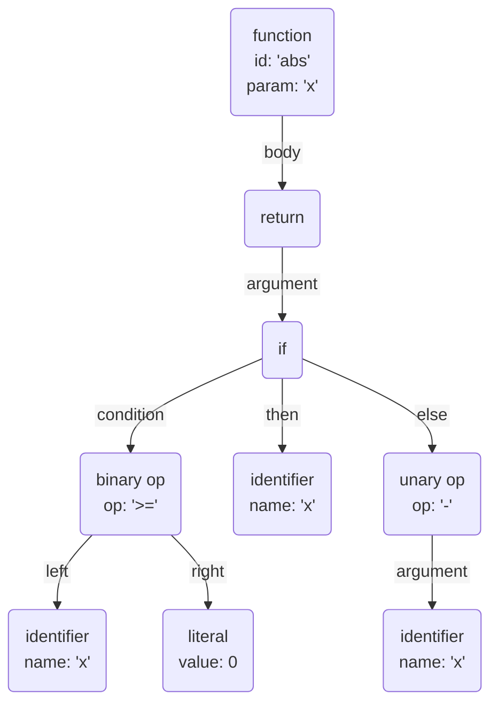

以下で示すラッパー関数のように，関数定義を見ると直ちにその関数が期待通りに動作するとわかる場合があります．そのような場合，**関数定義が意図せず変更されないこと**さえ保証できれば，その関数は十分に正しいと見做せます．テストピラミッド[^1]という概念が示すように，テストは費用対効果を考えながら行うべきであり，保証したいことに応じてテスト手法を選択すべきとも考えます．本稿では，「関数定義が意図せず変更されないこと」を**軽量に保証する**手法として，関数定義のスナップショットテストを提案します．

```ts
const sum = (xs: [number]): number => xs.reduce((x, y) => x + y, 0);
```

[^1]: 参考: [第 5 回 テストピラミッド ～自動テストの信頼性を中長期的に保つ最適なバランス～](https://gihyo.jp/dev/serial/01/savanna-letter/0005)

## 前提知識

本節では本稿を読み進めるために必要な前提知識を説明します．

### スナップショットテスト

[スナップショットテスト](https://jestjs.io/ja/docs/snapshot-testing)とは，フロントエンドを中心に使用されるテスト手法であり，主に UI が意図せず変更されないことを保証するために使用されています．例えば JavaScript (TypeScript) のテスティングフレームワークである [Jest](https://jestjs.io/ja/) では，テストコードを次のように記述してスナップショットテストを行います．

```ts
import { render } from "@testing-library/react";

test("Example", () => {
  const { container } = render(<p>Hello</p>);
  expect(container).toMatchSnapshot();
});
```

この例では `<p>Hello</p>` という HTML 要素をテストしています．初回のテスト実行では以下に示すようなスナップショットをファイルに保存するだけですが，2 回目以降はそのスナップショットとの差分が求められ，差分が存在すればテストに失敗し，そうでなければテスト通過となります．サンプルベーステストをはじめとする従来のテスト手法と比較して，テスト作成にかかるコストが遥かに少ない点が特徴的です．

```txt
// Jest Snapshot v1, https://goo.gl/fbAQLP

exports[`Example 1`] = `
<div>
  <p>
    Hello
  </p>
</div>
`;
```

やっていることは `diff` コマンドと同じようなものなので，スナップショットテストは UI 以外のテストにも活用できます．事例として，[Web API のレスポンス](https://zenn.dev/loglass/articles/595a91af94ff27)や [ESLint の設定ファイル](https://creators-note.chatwork.com/entry/2021/02/12/160808)に対するスナップショットテストが紹介されていたりします．

### 抽象構文木

[抽象構文木](https://ja.wikipedia.org/wiki/%E6%8A%BD%E8%B1%A1%E6%A7%8B%E6%96%87%E6%9C%A8)（abstract syntax tree, **AST**）とは，プログラマがいつも書いている構文からプログラムの動作に関係ない情報を取り除いた構文を表現する木です．抽象的で何を言ってるのかよくわからねーので具体例を見ます．

```js
// 絶対値を求める関数
function abs(x) {
  return x >= 0 ? x : -x;
}
```

上記の JavaScript プログラム の AST は，次の図で示すような木として表現されます．



この図を見ると，AST はコメントや括弧といった情報を含まないことがわかります．この意味で，AST はプログラムの動作に関係ない情報が取り除かれていると言えます[^2][^3]．プログラミング言語の処理系では，与えられたプログラムをまず AST に変換することが多いため，AST は言語処理系におけるプログラムの内部表現と考えてもらっても大丈夫です．

[^2]: ここでは深入りしないですが，AST の偉いところとして，構文を一意に定められることなどもあります（例えば AST に変換される前の文字列 `1 + 1 + 1` は，これだけ見ても `(1 + 1) + 1` なのか `1 + (1 + 1)` なのかわからない）．
[^3]: 一方で，実際の AST の実装では，親切なエラーメッセージを出すなどの目的で，プログラムの動作に関係ない情報（関数が定義されるファイル上の位置など）を多々含みます．コードレベルの AST に興味がある方は[こちら](https://astexplorer.net/#/gist/12386e3772e91877d7d907e38e35a8df/39f05a24e498f4678154f13b63743f4ec608e620)を参考にしてください．

## アプローチ

「関数定義が意図せず変更されないこと」を保証するため，**関数定義の AST に対してスナップショットテストを行う手法**を提案します．より正確には，関数定義の AST を文字列化したデータ（ざっくり言うと，テスト対象のソースコードをフォーマッタにより自動整形したソースコード）に対してスナップショットテストします．
AST を利用する最も大きな理由は，構文的に意味が変わらない場合にテストを落としたくないからです．例えば，単純にファイルの行数を指定して関数定義の文字列を得る場合，次のようにコメントが追加されるだけでテストが落ちてしまいます．これはテストの信頼性の観点から望ましくないでしょう．

```ts
// before
const foo = (): number => 1;

// after
const foo = (): number => 1; // 素敵なコメント
```

この手法を実現するためには，次の 2 つの要素を用意する必要があります．

1. スナップショットテストが可能なテスト環境
2. ファイル名と関数名を引数に取り，そのファイルに定義されたその関数定義の AST の文字列を返す関数

1 は Jest が担当してくれますが，2 は僕の調べた限りでは見つかりませんでした．そこで，今回 2 を担当する **dekun** というライブラリを開発しました．

https://www.npmjs.com/package/@ajfafg/dekun

### dekun とは

dekun とは，指定したファイルから，指定した変数定義または関数定義の AST の文字列を返す関数を提供する TypeScript 製のライブラリです．次のように使用します．

テスト対象

```ts
export const sum = (xs: [number]): number => xs.reduce((x, y) => x + y, 0);

function prod(xs: [number]): number {
  return xs.reduce((x, y) => x * y, 1);
}
```

テストコード

```ts
import { extract } from "@ajfafg/dekun";

describe("Demo", () => {
  it("sum", () => {
    expect(extract("src/foo.ts", "sum")).toMatchSnapshot();
  });
  it("prod", () => {
    expect(extract("src/foo.ts", "prod")).toMatchSnapshot();
  });
});
```

ライブラリ名は「Definition Extract 君」からきています．

### dekun の現在の仕様

- サポートする言語
  - TypeScript
- 参照可能な変数・関数定義
  - ファイルのトップレベルで定義された変数・関数
  - export の有無は関係ない
- その他の細かい仕様
  - `var` / `let` で定義された変数に対しては初回の変数宣言・代入を参照する
    - つまり，`let foo = 1; foo = 2;` は `let foo = 1;` が参照される
  - 指定する変数が他の変数と同時に定義される場合，その全ての変数定義が参照される
    - 例えば `const foo = 1, bar = 2;` に対して `foo` を指定すると `const foo = 1, bar = 2;` が参照される
    - `const foo = 1` だけを参照することは簡単ではなく，`foo = 1` だけを参照するのは簡単
    - `const` の情報が抜け落ちてしまうと，`const` を `var` に書き換えて好き放題やってもテストが落ちなくてヤバいので，今回は安全側に振っている
  - 二つの関数定義が構文的に意味が同じでも，本ライブラリを使用して得られる文字列が異なる場合がある
    - 例えば以下の 2 つの関数定義
    - これを避けるために AST を持ち出したのに対処しきれていなくて，本ライブラリのかなりウィークでクリティカルなポイントになってます
      - ~~いうて厳格なフォーマッタを使えば解決できる問題ではある~~

```ts
// First
function foo() {
  return 1;
}

// Second
function foo() {return 1;}
```

<!-- TODO: "Second" のプログラムが自動フォーマットされていないか記事を公開する前に確認する（`function foo() {return 1;}` が正しい） -->

現在は「関数定義をスナップショットテストする」という手法が受け入れられるか PoC 的に検証するため，最小限の機能のみ実装しています．機能改良のため，皆さんのご意見ご感想をいただけると嬉しいです．

## 考察

本手法は「関数定義が意図せず変更されないこと」しか保証できず，関数の動作の正しさは人間の判断に委ねられています．なので，全ての関数のテストを本手法で行ってしまうと翌週に地獄絵図が待ち構えていることは想像に難くありません[^4]．本手法が活きるのはラップ対象の関数が十分にテスト（または証明）されている場合に限ると考えています．とは言え，「十分」というのをどうやって判断するかも難しい問題ですね．カバレッジを見るといい？　少なくとも標準ライブラリは基本的によくテストされていると思いますが，結局のところチーム内で丁寧に合意をとっていくしかない気がします．
また，本手法で怖いのは，使用しているライブラリに破壊的変更があったときです．もしもシグネチャは変わっていないけれども動作が変わった関数をラップしていた場合，本手法ではその動作の変更を検知できません．この解決方法としては，ライブラリのバージョンを上げる際にラップ対象の関数の仕様が変更されたか確認することや，別のレイヤのテストを用意しておく，あたりかな……と思うのですが，あまりライブラリのバージョンアップに関する知見がなくて自信がありません．もしかすると考えすぎでこういうケースはあまりないかもしれないので，皆さんのご意見を大募集中です．

[^4]: 「何を見てヨシ！って言ったんですか？」

自分の提案手法を自分でディスりすぎたのでフォローしておくと，本手法は「テストしない意図」を明示するためにも使えるんじゃないかと考えています．まぁコメントで書き残しておくだけで十分かもですが，本手法を使うとその意図を伝えることに加えて関数定義が意図せず変更されないことも保証できます．お得です．今までレビュー等で人間が頑張っていた仕事を機械に任せられるのはそれなりの嬉しさがあるんじゃないかと思います．

## まとめ

本稿では，「関数定義が意図せず変更されないこと」を保証するアプローチとして，関数定義の AST に対してスナップショットテストを行う手法を提案しました．本手法は「ラッパー関数のように，関数定義を見ると直ちに期待通りに動作することがわかる」関数に対しては，サンプルベーステストをはじめとする従来のテスト手法と比較して，テスト作成にかかるコストを遥かに少なくできるものでした．一方で，そもそもそのような関数であると判断することが難しかったり，ラップ対象の関数に破壊的変更があった場合にテスト対象が期待通りに動作しなくなる恐れもありました．これらの問題点の解決方法は現在模索中でした．

今回は真面目に記事を書きすぎて疲れましたね．皆さんご一緒に

[^5]

[^5]: https://twitter.com/mattn_jp/status/1652294244709842945?s=20
